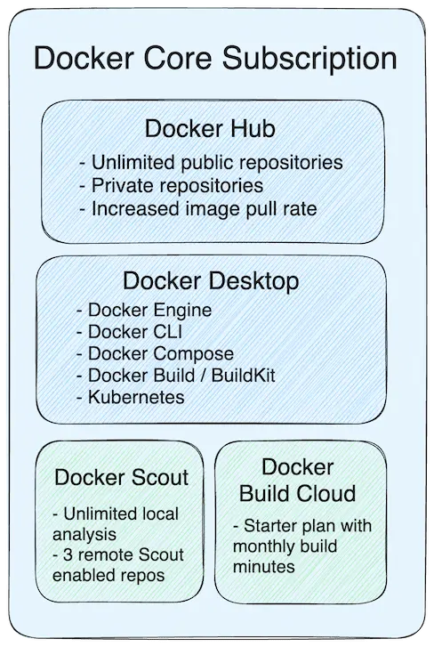

+++
title = "Subscriptions and features"
date = 2024-10-23T14:54:40+08:00
weight = 1
type = "docs"
description = ""
isCJKLanguage = true
draft = false
+++

> 原文: [https://docs.docker.com/subscription/core-subscription/details/](https://docs.docker.com/subscription/core-subscription/details/)
>
> 收录该文档的时间：`2024-10-23T14:54:40+08:00`

# Docker Core subscriptions and features

> **Important**
>
> 
>
> Docker is introducing enhanced subscription plans. Our new plans are packed with more features, higher usage limits, and simplified pricing. The new subscription plans take effect at your next renewal date that occurs on or after November 15, 2024. No charges on Docker Hub image pulls or storage will be incurred between November 15, 2024, and January 31, 2025. See [Announcing Upgraded Docker Plans](https://www.docker.com/blog/november-2024-updated-plans-announcement/) for more details and learn how your usage fits into these updates.

You can do more with Docker with a Docker Core subscription, such as add collaborators, create scoped access tokens, and create private repositories. This page provides an overview of each subscription tier. To compare features available in each tier, see [Docker Pricing](https://www.docker.com/pricing/).

The following describes some of the key features included with your Docker Core subscription:

3 Docker Scout-enabled repositories for advanced remote image analysis. You can purchase a Docker Scout subscription to enable more repositories. See [Docker Scout subscriptions and features](https://docs.docker.com/subscription/scout-details/).

Docker Build Cloud minutes are also included. For more information, see [Docker Build Cloud subscriptions and features](https://docs.docker.com/subscription/build-cloud/build-details/).

Docker maintains a [public roadmap](https://github.com/docker/roadmap) so subscribers can see what new features are in development, as well as request new capabilities.

## [Docker Personal](https://docs.docker.com/subscription/core-subscription/details/#docker-personal)

**Docker Personal** (formerly Docker Free) is ideal for open-source communities, individual developers, education, and small businesses, and includes the free use of Docker components including Docker Desktop and Docker Hub. Docker Personal includes:

- Unlimited public repositories
- Unlimited [Scoped Access Tokens](https://docs.docker.com/security/for-developers/access-tokens/)
- Unlimited [collaborators](https://docs.docker.com/docker-hub/repos/access/#collaborators-and-their-role) for public repositories at no cost per month.
- Access to [Docker Scout Free](https://docs.docker.com/subscription/scout-details/#docker-scout-free) to get started with software supply chain security.

Additionally, anonymous users get 100 pulls every 6 hours and users that sign in to Docker get 200 pulls every 6 hours.

For a list of features available in each tier, see [Docker Pricing](https://www.docker.com/pricing/).

## [Docker Pro](https://docs.docker.com/subscription/core-subscription/details/#docker-pro)

**Docker Pro** enables individual developers to get more control of their development environment and provides an integrated and reliable developer experience. It reduces the amount of time developers spend on mundane and repetitive tasks and empowers developers to spend more time creating value for their customers.

Docker Pro includes:

- All the features available in Personal
- Unlimited private repositories
- 5000 image [pulls per day](https://docs.docker.com/docker-hub/download-rate-limit/)
- [Auto Builds](https://docs.docker.com/docker-hub/builds/) with 5 concurrent builds
- 300 [Vulnerability Scans](https://docs.docker.com/docker-hub/vulnerability-scanning/)

For a list of features available in each tier, see [Docker Pricing](https://www.docker.com/pricing/).

## [Docker Team](https://docs.docker.com/subscription/core-subscription/details/#docker-team)

**Docker Team** offers capabilities for collaboration, productivity, and security across organizations. It enables groups of developers to unlock the full power of collaboration and sharing combined with essential security features and team management capabilities. A Docker Team subscription includes licensing for commercial use of Docker components including Docker Desktop and Docker Hub.

Docker Team includes:

- Everything included in Docker Pro
- Unlimited teams
- [Auto Builds](https://docs.docker.com/docker-hub/builds/) with 15 concurrent builds
- Unlimited [Vulnerability Scanning](https://docs.docker.com/docker-hub/vulnerability-scanning/)
- 5000 image [pulls per day](https://docs.docker.com/docker-hub/download-rate-limit/) for each team member

There are also advanced collaboration and management tools, including organization and team management with [Role Based Access Control (RBAC)](https://docs.docker.com/security/for-admins/roles-and-permissions/), [activity logs](https://docs.docker.com/admin/organization/activity-logs/), and more.

For a list of features available in each tier, see [Docker Pricing](https://www.docker.com/pricing/).

## [Docker Business](https://docs.docker.com/subscription/core-subscription/details/#docker-business)

**Docker Business** offers centralized management and advanced security features for enterprises that use Docker at scale. It empowers leaders to manage their Docker development environments and speed up their secure software supply chain initiatives. A Docker Business subscription includes licensing for commercial use of Docker components including Docker Desktop and Docker Hub.

Docker Business includes:

- Everything included in Docker Team
- [Hardened Docker Desktop](https://docs.docker.com/security/for-admins/hardened-desktop/)
- [Image Access Management](https://docs.docker.com/security/for-admins/hardened-desktop/image-access-management/) which lets admins control what content developers can access
- [Registry Access Management](https://docs.docker.com/security/for-admins/hardened-desktop/registry-access-management/) which lets admins control what registries developers can access
- [Company layer](https://docs.docker.com/admin/company/) to manage multiple organizations and settings
- [Single Sign-On](https://docs.docker.com/security/for-admins/single-sign-on/)
- [System for Cross-domain Identity Management](https://docs.docker.com/security/for-admins/provisioning/scim/) and more.

For a list of features available in each tier, see [Docker Pricing](https://www.docker.com/pricing/).

### [Self-serve](https://docs.docker.com/subscription/core-subscription/details/#self-serve)

A self-serve Docker Business subscription is where everything is set up by you. You can:

- Manage your own invoices
- Add or remove seats
- Update billing and payment information
- Downgrade your subscription at any time

### [Sales-assisted](https://docs.docker.com/subscription/core-subscription/details/#sales-assisted)

A sales-assisted Docker Business subscription where everything is set up and managed by a dedicated Docker account manager.

### [Support for subscriptions](https://docs.docker.com/subscription/core-subscription/details/#support-for-subscriptions)

All Docker Pro, Team, and Business subscribers receive email support for their subscriptions. Additional premium support is available for Docker Business customers. [Contact sales](https://www.docker.com/pricing/contact-sales/) for more information about premium support programs.
