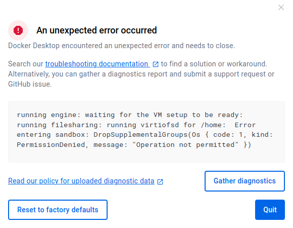
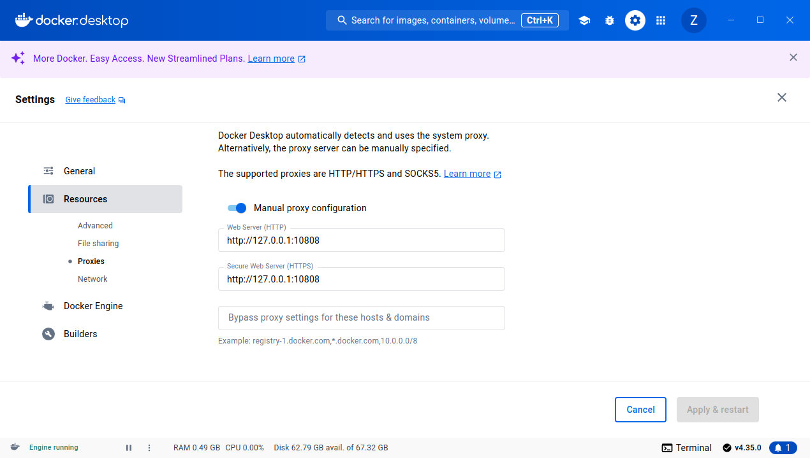

+++
title = "安装和使用 - Ubuntu"
date = 2024-11-02T16:24:27+08:00
weight = 1
type = "docs"
description = ""
isCJKLanguage = true
draft = false

+++

## 安装

```sh
sudo apt-get install ca-certificates curl
sudo install -m 0755 -d /etc/apt/keyrings
curl -fsSL https://download.docker.com/linux/ubuntu/gpg | sudo gpg --dearmor -o /etc/apt/keyrings/docker.gpg
sudo chmod a+r /etc/apt/keyrings/docker.gpg

# Add the repository to Apt sources:
echo \
  "deb [arch=$(dpkg --print-architecture) signed-by=/etc/apt/keyrings/docker.gpg] https://mirrors.aliyun.com/docker-ce/linux/ubuntu \
$(lsb_release -cs) stable" | \
  sudo tee /etc/apt/sources.list.d/docker.list > /dev/null
sudo apt-get update

# 安装最新版
sudo apt-get install docker-ce docker-ce-cli containerd.io docker-buildx-plugin docker-compose-plugin


# 手动启动 Docker 守护进程服务 和 手动启动 containerd 进程服务
sudo systemctl start docker && sudo systemctl start containerd

# 设置 Docker 和 containerd 开机自动启动
sudo systemctl enable docker.service && sudo systemctl enable containerd.service
```

​	若需要开启启动，请参照：[使用 systemd 配置 Docker 开机启动](http://dd.cn/manuals/DockerEngine/Install/Post-installationsteps/#使用-systemd-配置-docker-开机启动-configure-docker-to-start-on-boot-with-systemd)。

 	接着就是查看`docker`这个用户组，是否存在：

```sh
sudo getent group docker
```


​	 以及查看当前用户是否在`docker`这个用户组中：

```
groups $USER
```

 	若不在`docker`这个用户组中，可以通过以下命令进行添加：

```sh
sudo usermod -aG docker $USER
```


## 配置阿里云镜像加速器（目前已失效）

> ​	参照：[https://cr.console.aliyun.com/cn-hangzhou/instances/mirrors](https://cr.console.aliyun.com/cn-hangzhou/instances/mirrors)

```
sudo mkdir -p /etc/docker
sudo tee /etc/docker/daemon.json <<-'EOF'
{
  "registry-mirrors": ["https://ate93ynsdi.mirror.aliyuncs.com"]
}
EOF
sudo systemctl daemon-reload
sudo systemctl restart docker
```

​	

> **阿里云官网给出的变更说明** 
>
> ​	参见：[https://help.aliyun.com/zh/acr/product-overview/product-change-acr-mirror-accelerator-function-adjustment-announcement](https://help.aliyun.com/zh/acr/product-overview/product-change-acr-mirror-accelerator-function-adjustment-announcement)
>
> ​	摘录部分内容如下：	
>
> > ​	为进一步规范镜像加速器工具的使用，容器镜像服务ACR将于2024年07月02日起对镜像加速器功能进行相应的调整。
> >
> > **变更内容**
> >
> > ​	调整镜像加速器功能的使用范围：
> >
> > - 仅限阿里云用户在其支持公网访问的阿里云产品上使用该镜像加速能力。
> >
> >
> > - 仅支持通过镜像加速器拉取限定范围内的容器镜像。

​	所以，若不是使用阿里云产品，目前来看已经是不能使用其镜像加速能力了。

## 目前国内可用Docker镜像源汇总

​	请直接参照：[https://www.coderjia.cn/archives/dba3f94c-a021-468a-8ac6-e840f85867ea](https://www.coderjia.cn/archives/dba3f94c-a021-468a-8ac6-e840f85867ea)

```sh
# 请使用 bash , 若使用 fish 可能报错
sudo mkdir -p /etc/docker
sudo tee /etc/docker/daemon.json <<-'EOF'
{
    "registry-mirrors": [
    	"https://docker.unsee.tech",
        "https://dockerpull.org",
        "https://docker.1panel.live",
        "https://dockerhub.icu"
    ]
}
EOF
# 重启docker服务
sudo systemctl daemon-reload && sudo systemctl restart docker
```


## 为什么你不能使用`docker search`命令？

​	例如：

```sh
docker search nginx
Error response from daemon: Get "https://index.docker.io/v1/search?q=nginx&n=25": dial tcp 108.160.166.137:443: i/o timeout
```

​	你会看到，其需要访问`index.docker.io`这一域名，目前国内是访问不了的，不信，你通过`ping index.docker.io` 命令试试，除非你使用了代理。

​	

## 卸载

```sh
sudo apt-get purge docker-ce docker-ce-cli containerd.io docker-buildx-plugin docker-compose-plugin docker-ce-rootless-extras
```

例如：

```sh
root@lxm:~# sudo apt-get purge docker-ce docker-ce-cli containerd.io docker-buildx-plugin docker-compose-plugin docker-ce-rootless-extras
正在读取软件包列表... 完成
正在分析软件包的依赖关系树... 完成
正在读取状态信息... 完成                 
下列软件包是自动安装的并且现在不需要了：
  golang-1.22-go golang-1.22-src golang-any golang-go golang-src ipxe-qemu ipxe-qemu-256k-compat-efi-roms libboost-thread1.83.0 libcacard0 libdaxctl1 libfdt1 libiscsi7
  libndctl6 libpmem1 libpmemobj1 librados2 librbd1 librdmacm1t64 libsass1 libslirp0 libspice-server1 libsubid4 liburing2 libusbredirparser1t64 libvirglrenderer1 ovmf pass
  pigz qemu-block-extra qemu-system-common qemu-system-data qemu-system-gui qemu-system-modules-opengl qemu-system-modules-spice qemu-system-x86 qemu-utils qrencode seabios
  slirp4netns uidmap wl-clipboard xclip
使用'sudo apt autoremove'来卸载它(它们)。
下列软件包将被【卸载】：
  containerd.io* docker-buildx-plugin* docker-ce* docker-ce-cli* docker-ce-rootless-extras* docker-compose-plugin*
升级了 0 个软件包，新安装了 0 个软件包，要卸载 6 个软件包，有 51 个软件包未被升级。
解压缩后将会空出 441 MB 的空间。
您希望继续执行吗？ [Y/n] y
(正在读取数据库 ... 系统当前共安装有 255158 个文件和目录。)
正在卸载 docker-ce (5:27.3.1-1~ubuntu.24.04~noble) ...
正在卸载 containerd.io (1.7.22-1) ...
正在卸载 docker-buildx-plugin (0.17.1-1~ubuntu.24.04~noble) ...
正在卸载 docker-ce-cli (5:27.3.1-1~ubuntu.24.04~noble) ...
正在卸载 docker-ce-rootless-extras (5:27.3.1-1~ubuntu.24.04~noble) ...
正在卸载 docker-compose-plugin (2.29.7-1~ubuntu.24.04~noble) ...
正在处理用于 man-db (2.12.0-4build2) 的触发器 ...
(正在读取数据库 ... 系统当前共安装有 254925 个文件和目录。)
正在清除 docker-ce (5:27.3.1-1~ubuntu.24.04~noble) 的配置文件 ...
dpkg: 警告: 卸载 docker-ce 时，目录 /etc/docker 非空，因而不会删除该目录
正在清除 containerd.io (1.7.22-1) 的配置文件 ...

```

​	因` 目录 /etc/docker 非空`，故手动删除这个目录：

```sh
sudo rm -rf /etc/docker
```

​	若之前存在`/etc/systemd/system/docker.service.d`目录，其也不会被自动删除。

## 配置代理

1. 创建`/etc/systemd/system/docker.service.d`目录;

2. 往`/etc/systemd/system/docker.service.d/http-proxy.conf` 文件中写入以下内容:

   ```conf
   [Service]
   Environment="HTTP_PROXY=http://your.proxy.server:port"
   Environment="HTTPS_PROXY=http://your.proxy.server:port"
   Environment="NO_PROXY=localhost,127.0.0.1"
   ```

   `your.proxy.server:port`替换成你指定的代理，例如：`127.0.0.1:10808`

   ```
   [Service]
   Environment="HTTP_PROXY=http://127.0.0.1:10808"
   Environment="HTTPS_PROXY=http://127.0.0.1:10808"
   Environment="NO_PROXY=localhost,127.0.0.1"
   ```

   

3. 重启docker服务：

   ```sh
   sudo systemctl daemon-reload && sudo systemctl restart docker
   ```
   


## Docker 镜像的存放路径

​	`/var/lib/docker`目录下的`image`目录。


## 为docker这个命令设置别名

**bash 的配置文件 `/etc/bash.bashrc`** 

​	在该文件的末尾添加：

```sh
alias d='docker'
```

​	若要立即生效，请执行以下命令：

```sh
source /etc/bash.bashrc
```

**fish的配置文件 `~/.config/fish/config.fish`**

​	在该文件的末尾添加：

```sh
alias d='docker'
```

​	若要立即生效，请执行以下命令：

```sh
source ~/.config/fish/config.fish
```

## docker常用命令

### docker build

```sh
docker build -t <tag_name> .

docker build --network=host -t <tag_name> .
```

### docker login

```sh
docker login -u <username>
```


### docker run

```sh
# 
docker run -dp 127.0.0.1:3000:3000 <image_name>[:latest]

# 
docker run -d --name <container_name> \
 -p 127.0.0.1:3000:3000 
 --mount src=myvol1,dst=/app \
 <image_name>[:latest]
 
 # --rm ：当容器退出时，自动删除容器及其关联的匿名卷
 # --mount 挂载
 docker run --rm --mout type=volume,src=<volume_name>,dst=/logs <image_name>[:latest] mkdir -p /logs/app1 /logs/app2
 docker run -d --name app1 --mount type=volume,src=<volume_name>,src=logs,dst=/var/log/app1/,volume-subpath=app1 <image_name>[:latest]
  docker run -d --name app2 --mount type=volume,src=<volume_name>,src=logs,dst=/var/log/app1/,volume-subpath=app2 <image_name>[:latest]
  
  # 
```

### docker volume

```sh
# 创建
docker volume create <volume_name>

# 列出
docker volume ls

# 查看
docker volume inspect <volume_name>

# 移除
docker volume rm <volume_name>
```

docker 


```sh
lx@lxm ~/Desktop> gpg --generate-key                                                                                                                      
gpg (GnuPG) 2.4.4; Copyright (C) 2024 g10 Code GmbH
This is free software: you are free to change and redistribute it.
There is NO WARRANTY, to the extent permitted by law.

注意：使用 “gpg --full-generate-key” 以获得一个全功能的密钥生成对话框。

GnuPG 需要构建用户标识以辨认您的密钥。

真实姓名： zlongx
电子邮件地址： zlongxiangde@gmail.com
您选定了此用户标识：
    “zlongx <zlongxiangde@gmail.com>”

更改姓名（N）、注释（C）、电子邮件地址（E）或确定（O）/退出（Q）？ O
我们需要生成大量的随机字节。在质数生成期间做些其他操作（敲打键盘
、移动鼠标、读写硬盘之类的）将会是一个不错的主意；这会让随机数
发生器有更好的机会获得足够的熵。
我们需要生成大量的随机字节。在质数生成期间做些其他操作（敲打键盘
、移动鼠标、读写硬盘之类的）将会是一个不错的主意；这会让随机数
发生器有更好的机会获得足够的熵。
gpg: 目录‘/home/lx/.gnupg/openpgp-revocs.d’已创建
gpg: 吊销证书已被存储为‘/home/lx/.gnupg/openpgp-revocs.d/2953C26DEA5BBF55BD0B980CE27EEFE03C7DD23A.rev’
公钥和私钥已经生成并被签名。

pub   ed25519 2024-11-06 [SC] [有效至：2027-11-06]
      2953C26DEA5BBF55BD0B980CE27EEFE03C7DD23A
uid                      zlongx <zlongxiangde@gmail.com>
sub   cv25519 2024-11-06 [E] [有效至：2027-11-06]
lx@lxm ~/Desktop> pass init 2953C26DEA5BBF55BD0B980CE27EEFE03C7DD23A                                                                                      
mkdir: 已创建目录 '/home/lx/.password-store/'                                                                                                             
Password store initialized for 2953C26DEA5BBF55BD0B980CE27EEFE03C7DD23A

```


## docker-desktop启动时报错 (之后发现其实是版本不对，改用4.35.0安装就可以)

​	在`~.docker/desktop/log/host/Docker Desktop.stderr.log`文件中有如下内容：

```txt
FATAL:setuid_sandbox_host.cc(158)] The SUID sandbox helper binary was found, but is not configured correctly. Rather than run without sandboxing I'm aborting now. You need to make sure that `/opt/docker-desktop/chrome-sandbox` is owned by root and has mode 4755.
```

​	查看`/opt/docker-desktop/chrome-sandbox`：

```sh
lx@lxm /o/d/bin> ll /opt/docker-desktop/chrome-sandbox                                                                                                    
-rwxr-xr-x 1 root root 53K Oct  8 23:57 /opt/docker-desktop/chrome-sandbox* 
```

​	果然，该文件的权限mode只是`755`，修改文件的权限mode：

```
lx@lxm /o/d/bin> sudo chmod 4755 /opt/docker-desktop/chrome-sandbox                                                                                       
lx@lxm /o/d/bin> ll /opt/docker-desktop/chrome-sandbox                                                                                                    
-rwsr-xr-x 1 root root 53K Oct  8 23:57 /opt/docker-desktop/chrome-sandbox* 
```

​	可以看到修改后，该文件的权限已经是`4755`了。

​	重新启动`docker-desktop`:

```sh
systemctl --user restart /opt/docker-desktop/bin/docker-desktop
```

​	这样就看到了`docker-desktop`的启动窗口了！




```txt
An unexpected error occurred
Docker Desktop encountered an unexpected error and needs to close.

Search our troubleshooting documentation ⁠ to find a solution or workaround. Alternatively, you can gather a diagnostics report and submit a support request or GitHub issue.

running engine: waiting for the Docker API: engine linux/qemu failed to run: running VM: running virtiofsd for /home:  Error entering sandbox: DropSupplementalGroups(Os { code: 1, kind: PermissionDenied, message: "Operation not permitted" })
```

```txt
An unexpected error occurred
Docker Desktop encountered an unexpected error and needs to close.

Search our troubleshooting documentation ⁠ to find a solution or workaround. Alternatively, you can gather a diagnostics report and submit a support request or GitHub issue.

running engine: resetting socket forwarder: starting: configuring options: computing socketforward options: qemu lacks support for networkType vpnkit
```

## docker -desktop登录不了用户



​	找到`设置->Resources->Proxies`，启用 `Manual proxy configuration`，填入相关代理，即可登录成功。
